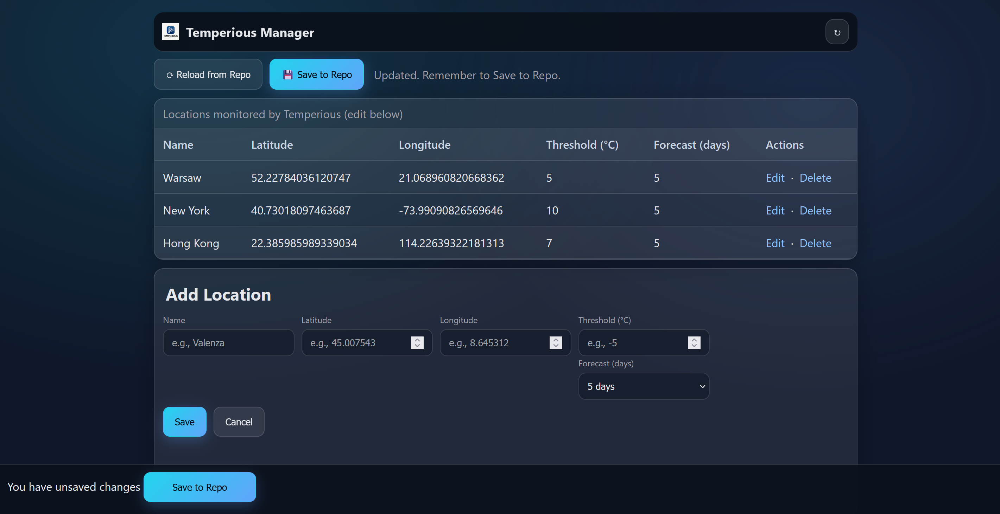

# 🌡️ Temperious Manager

> *“Where weather meets code, and curiosity meets control.”*  
> — Temperious Team  

---

  
  
  
  
  
  
  

## 🧭 Overview

**Temperious Manager** is a web-based control panel for managing the cities and temperature thresholds used by the [Temperious](https://github.com/katawiecz/temperious) weather alert system.  

It provides a clean, responsive interface for editing, adding, and deleting locations directly from your GitHub repository — no manual commits required.  

The panel integrates seamlessly with **GitHub Actions**, **OpenWeather**, and **Pushover**, letting you control weather alert logic from your phone or desktop.

---

## 🖼️ Demo Preview

Take a quick look at **Temperious Manager** in action 👇  

  

  

🎥 **Demo video**  
You can also watch a short walkthrough of the app:  
➡️ [View Demo (MP4)](./assets/img/demo.mp4)

---

## ✨ Key Features

🌍 **Multi-location management**  
Easily add and organize multiple cities — from Valenza to Turin and beyond.

📦 **Direct GitHub sync**  
Changes are committed straight to your repository’s `locations.json` via the GitHub API.

🔔 **Automated weather alerts**  
Paired with the main [Temperious](https://github.com/katawiecz/temperious) project, your configured thresholds trigger push notifications via Pushover when the temperature drops below your defined level.

📱 **Mobile-first design**  
Built with responsive layouts, large touch-friendly buttons, and a glassy, minimalist interface.

💾 **Serverless & secure**  
Powered by **Vercel Functions** and **fine-grained GitHub tokens**, ensuring safe commits without exposing credentials.

🎨 **Designed for clarity**  
Dark, atmospheric visuals reflecting the calm before the frost — and the thrill of automation.

---

## 🧩 Architecture

Temperious Manager
├── index.html # Main user interface
├── style.css # Responsive glassy theme
├── app.js # Frontend logic (fetch, validation, state)
└── api/
└── locations.js # Serverless backend (Vercel)

**Tech Stack**

| Layer | Technology |
|:------|:------------|
| Frontend | HTML5, CSS3 (glassy theme), Vanilla JavaScript |
| Backend | Node.js (Serverless / Vercel) |
| Data Source | GitHub REST API (`locations.json`) |
| Weather | OpenWeather 5-day / 3-hour forecast |
| Notifications | Pushover API |
| Hosting | Vercel (Hobby Tier) |

---

## ⚙️ Environment Variables

| Variable | Description |
|-----------|-------------|
| `GITHUB_TOKEN` | Fine-grained personal access token (read/write to `temperious` repo) |
| `GITHUB_OWNER` | Your GitHub username (e.g., `katawiecz`) |
| `GITHUB_REPO` | Target repository (e.g., `temperious`) |
| `GITHUB_BRANCH` | Branch to update (e.g., `main`) |
| `GITHUB_FILE_PATH` | Path to `locations.json` file |

---

## 🚀 Deployment

### 1️⃣ Clone the repository

git clone https://github.com/katawiecz/temperious-manager.git
cd temperious-manager

2️⃣ Deploy to Vercel

Go to vercel.com/new

Import your repository

Set environment variables

Deploy 🎉

###  💡 How it Works

The frontend loads the locations.json file from the Temperious repository through the GitHub API.

You can edit cities, thresholds, or add new ones directly in the panel.

When you hit Save to Repo, the backend commits changes securely using your GitHub token.

The Temperious GitHub Action reads those values and triggers Pushover alerts when tomorrow’s minimum temperature is below your threshold.

---

## 🧠 Tech Stack

| Layer | Technology |
|:------|:------------|
| **Frontend** | HTML5, CSS3 *(glassy theme)*, Vanilla JS |
| **Backend** | Node.js *(Serverless / Vercel)* |
| **Data Source** | GitHub REST API (`locations.json`) |
| **Weather** | OpenWeather 5-day / 3-hour forecast |
| **Notifications** | Pushover API |
| **Hosting** | Vercel *(Hobby Tier)* |

> *A simple stack with strong fundamentals — minimal dependencies, maximum clarity.*

##  🧊 Credits

Design & Development: Kasia Wieczorek

Weather Data: OpenWeather

Notifications: Pushover

Hosting: Vercel

##  🪄 License

This project is licensed under the MIT License — simple, open, and community-friendly.
You are free to use, modify, and share this code, provided that you keep the original copyright notice.

For more details, see the full license documents in the LICENSE/
 folder:

LICENSE.md
 — full MIT license text

NOTICE.md
 — third-party acknowledgements

CREDITS.md
 — design and development credits

“Code is colder when shared with warmth.” ❄️
© 2025 Kasia Wieczorek